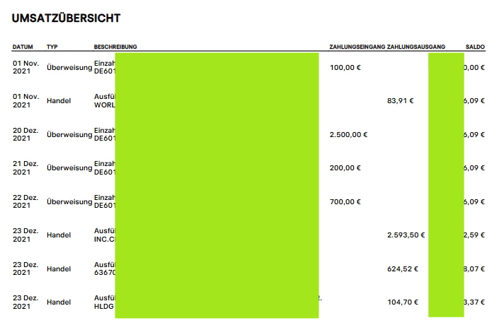
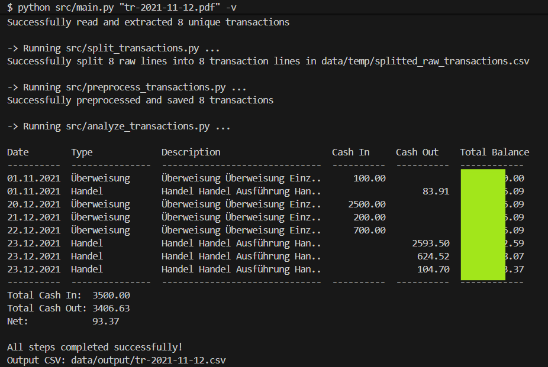

# Simple **fully local** PDF-to-CSV Bank Statement Converter
### Tested PDF to CSV Conversions
- Bank of America (US)
- Traderpublik (Germany)
- Commerzbank (Germany)

## How to use this application

1. Simply put your PDF bank statement into `data/input/<your-pdf-statement.pdf>
`
2. Run the following command in your terminal

   ```bash
   python src/main.py <your-pdf-statement.pdf>

## Example Run
### Traderepublik bank statement


