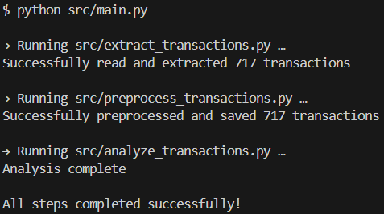

# Simple PDF Bank Statement Reader

Converts PDF bank statements to CSV files and prints a transaction summary to the terminal.

### Tested PDF to CSV Conversions
- Trade Republic
- Commerzbank

## How to use this application?

1) Place your PDF bank statement into `./data/input/`
2) Run `python src/main.py statement.pdf`

The tool automatically finds the PDF in `data/input/`, detects the bank format, and writes the output CSV to `data/output/` (named after the input file, e.g. `statement.csv`).

You can also pass a full path: `python src/main.py data/input/my-statement.pdf`



### Output CSV Format
Date, Type, Description, Cash In, Cash Out, Total Balance

### Directory Structure
```
data/
  input/    <- place PDF statements here
  output/   <- extracted CSV files appear here
  temp/     <- intermediate files (for debugging)
```

### Dependencies
```bash
pip install pdfplumber pandas
```
